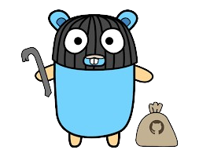

# 🏄‍♂️ Hey, I'm Rounak

**`A passionate Fullstack Developer`**

- 🌱 I’m currently studying **Computer Science & Engineering.**

- 🧑‍💻 Interested in **Artificial Intelligence & Software Development.**

- 📫 How to reach me **rounaknayak02@gmail.com**

<h3 align="left">Connect with me:</h3>

---

### 🧰 Languages and Tools:

  
  
  
  
  
  
  
  
  
  
  
  
  
  

 
 

## Let's colab 🚀

🌟 I'm always open to collaborating on exciting projects and ideas. If you share similar interests or have a project you'd like to work on together, feel free to reach out on the socials below!

  
  <a href="https://linkedin.com/in/rounaknayak" target="_blank">

 
  
 

  

